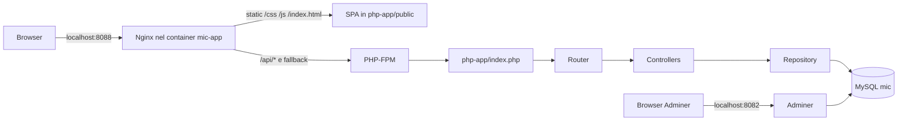

# Architecture - MIC Monolith

Questo documento cattura la forma runtime di MIC: quali componenti girano e
come una richiesta attraversa browser, app PHP e database.

## Vista d'insieme

## Componenti in esecuzione

| Componente | Dove | Ruolo |
|---|---|---|
| Browser | Host utente | Carica la SPA e chiama le API JSON. |
| `mic-app` | Container su `localhost:8088` | Contiene Nginx, PHP-FPM e codice applicativo. |
| Nginx | Dentro `mic-app` | Serve asset statici e passa API/fallback a PHP-FPM. |
| PHP-FPM | Dentro `mic-app` | Esegue il front controller PHP. |
| `mysql` | Container su `localhost:3306` | Database `mic`, inizializzato da `database/*.sql`. |
| `adminer` | Container su `localhost:8082` | Ispezione manuale del database. |
| `mic_db_data` | Volume Docker | Persistenza MySQL tra riavvii. |

I file da cui partire sono `docker-compose.yml`, `Dockerfile`, `nginx.conf` e
`php-app/index.php`.

## Flusso: caricamento GUI

1. Il browser apre `http://localhost:8088`.
2. Docker inoltra la richiesta al container `mic-app`.
3. Nginx serve `php-app/public/index.html` e gli asset `/css` e `/js`.
4. La SPA registra le viste da `php-app/public/js/*.js`.
5. La navigazione avviene con hash route tipo `#/orders`, senza reload pagina.

## Flusso: chiamata API

Esempio: `GET /api/orders`.

1. Una vista JS chiama `fetch('/api/orders')`.
2. Nginx passa la richiesta a PHP-FPM.
3. PHP-FPM esegue `php-app/index.php`.
4. Il front controller registra le rotte e chiama `Router::dispatch()`.
5. Il router invoca il controller, per esempio `OrderController`.
6. Il controller usa `Repository`.
7. Il repository legge o scrive `business_data` e `business_relations`.
8. Il controller traduce i campi generici in JSON per la GUI.
9. Il browser aggiorna la vista.

## Flusso: database browser

Adminer gira separato dalla app. Serve per guardare il database reale:

- URL: `http://localhost:8082`;
- server: `mysql`;
- database: `mic`;
- user/password: `root` / `root`.

## Cosa imparare da questa architettura

Il sistema sembra diviso in schermate e controller, ma a runtime e' un monolite:

- una sola app PHP;
- un solo database;
- un solo repository generico;
- nessun confine tecnico tra domini.

Questa e' la cosa importante per la modernizzazione: prima di estrarre un
servizio bisogna spezzare dipendenze dati, non solo spostare controller.

