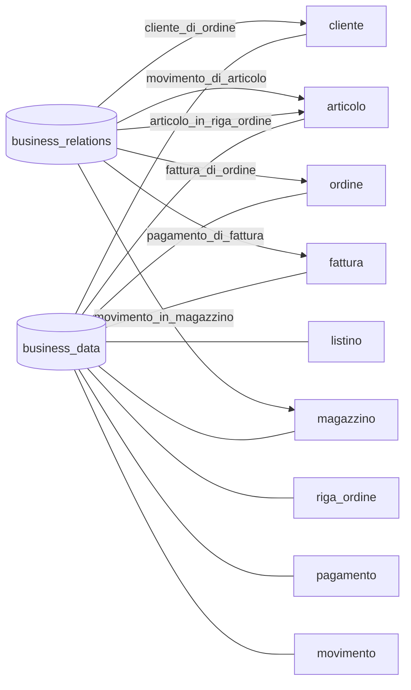

# Coupling Map - MIC Monolith

Questa mappa evidenzia gli accoppiamenti che contano per una futura estrazione.
Non elenca ogni colonna: mostra dove il sistema e' intrecciato davvero.

## Tesi

La GUI separa i domini, il database no.

Tutti i concetti principali vivono in:

- `business_data`, con una colonna `record_type`;
- `business_relations`, con una colonna `relation_type`.

`cliente`, `articolo`, `ordine`, `riga_ordine`, `fattura`, `movimento` e
`pagamento` non sono tabelle diverse: sono righe diverse nella stessa tabella.
Il significato dei campi generici (`amount_1`, `text_1`, `date_1`, ecc.) viene
deciso dai controller.

## La forma del dato

## Accoppiamenti peggiori

### 1. Ordini -> Articoli, IVA, Listini, Cliente, Agente

L'ordine e' il punto piu' intrecciato. Per creare e valorizzare righe ordine,
il codice legge articolo e IVA; la testata ordine collega cliente, listino e
agente.

Perche' fa male: Sales non puo' essere estratto senza decidere come ottenere
SKU, prezzo, IVA e dati cliente. Warehouse/Pricing/Fiscale sono dentro il flusso
ordine.

Da spezzare con: snapshot riga ordine, API/read model catalogo, riferimento
cliente stabile.

### 2. Magazzino -> Articoli

I movimenti di magazzino sono collegati agli articoli e le giacenze sono
calcolate sommando movimenti per articolo e magazzino.

Perche' fa male: se Warehouse viene estratto, deve possedere o almeno conoscere
un'identita articolo stabile. Oggi quell'identita e' una riga del database
condiviso.

Da spezzare con: ownership chiara dell'articolo, evento/API di catalogo o replica
read model.

### 3. Listini -> Articoli

Le voci listino collegano prezzi e articoli. Il pricing commerciale dipende
dalla stessa anagrafica articolo usata da ordini e magazzino.

Perche' fa male: cambiare modello articolo impatta listini e ordini. Estrarre
Catalogo/Warehouse obbliga a ripensare come Pricing legge gli articoli.

Da spezzare con: prezzi legati a SKU stabile e non a riga generica condivisa.

### 4. Fatture -> Ordini e Clienti

La fattura collega ordine e cliente, e pagamenti/note credito collegano la
fattura.

Perche' fa male: Fatturazione ha bisogno di dati fiscali stabili. Se cliente o
ordine cambiano, la fattura dovrebbe restare coerente; oggi il legame e' solo
una relazione generica nel database.

Da spezzare con: snapshot fiscale in fattura e riferimenti espliciti a ordine e
cliente.

### 5. Dashboard -> Tutto

La dashboard aggrega fatture, ordini, clienti, articoli e audit.

Perche' fa male: dopo una estrazione, una dashboard che fa query dirette sul DB
monolitico diventa un freno. Ogni servizio estratto rompe o duplica query.

Da spezzare con: read model dedicata o eventi di reporting.

## Evidenze minime

Queste relazioni bastano a mostrare la forma degli intrecci:

| Relazione | Cosa mostra |
|---|---|
| `articolo_in_riga_ordine` | Sales dipende dal Catalogo. |
| `iva_di_riga` | Sales dipende da Fiscale/configurazione. |
| `articolo_di_voce` | Pricing dipende dal Catalogo. |
| `movimento_di_articolo` | Warehouse dipende dal Catalogo. |
| `fattura_di_ordine` | Fatturazione dipende da Sales. |
| `pagamento_di_fattura` | Incassi dipendono da Fatturazione. |

## Cosa dovrebbe sapere un team prima di estrarre Warehouse

Warehouse sembra il primo candidato naturale, ma non e' isolato. Prima di
estrarlo bisogna decidere:

1. chi possiede l'articolo;
2. come Sales e Pricing leggeranno SKU, nome, prezzo e IVA;
3. se le righe ordine devono conservare snapshot dei dati articolo;
4. dove vivra' il calcolo delle giacenze;
5. come la dashboard ricevera' dati dopo l'estrazione.
